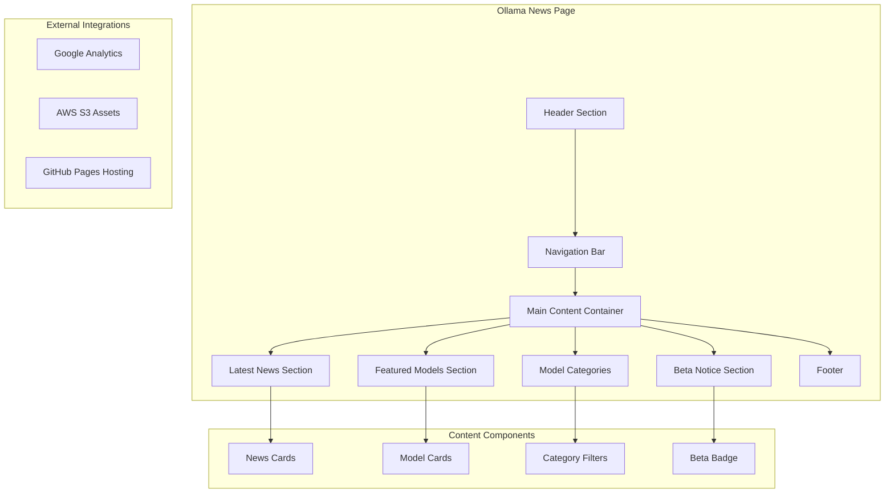
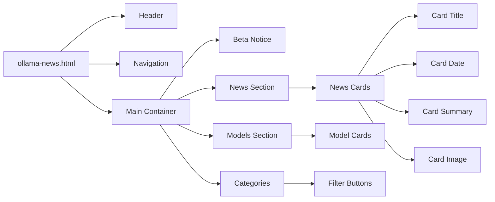
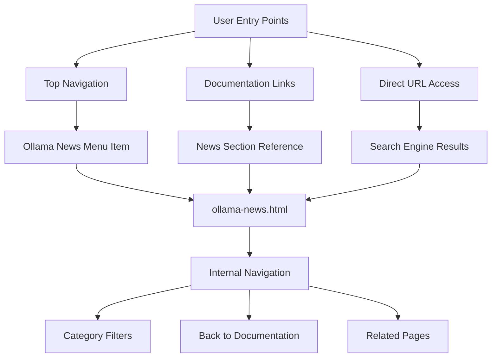
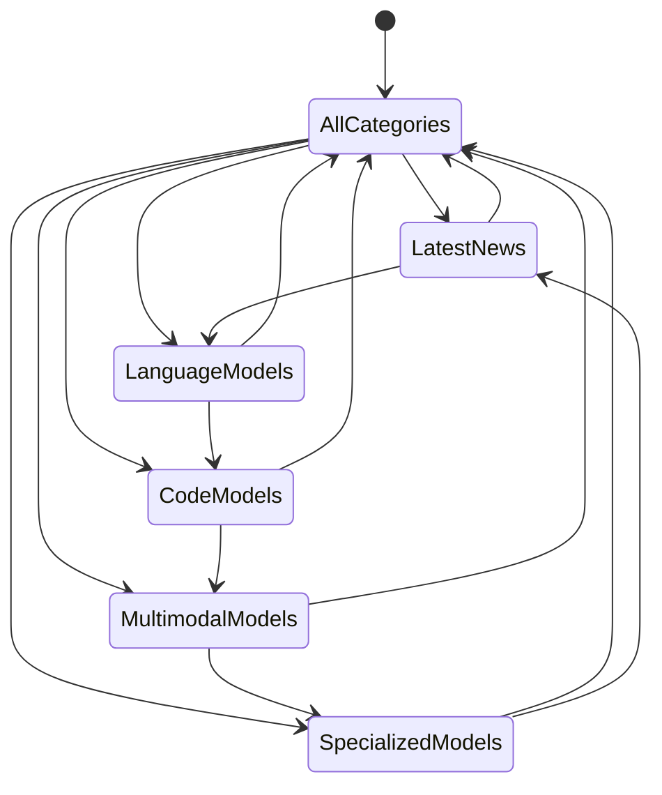
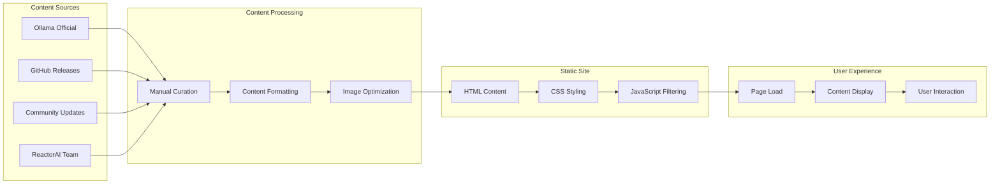
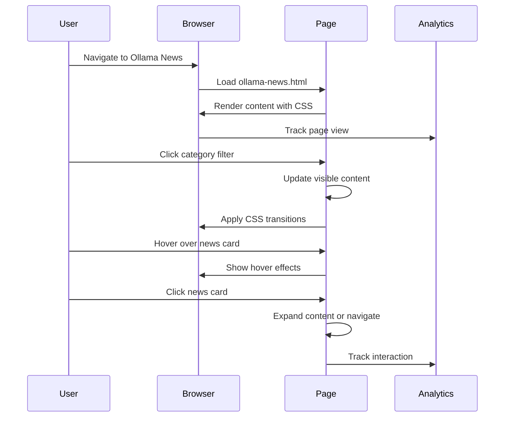

# Design Document: Add Ollama Models News Page (Beta)

## Overview

This design document outlines the implementation of a new Ollama Models News page for the ReactorAI documentation website. The page will serve as a dedicated resource for users to stay updated on the latest Ollama model releases, updates, and announcements. This feature aligns with ReactorAI's core mission of providing comprehensive support for Ollama and Gemini AI models.

### Purpose
- Provide centralized access to Ollama model news and updates
- Keep ReactorAI users informed about new model releases
- Enhance user engagement through timely and relevant content
- Support the community with curated information about model capabilities

### Target Users
- ReactorAI app users seeking model updates
- AI enthusiasts interested in Ollama model developments
- Developers integrating new models into their workflows
- Community members following AI model trends

## Technology Stack & Dependencies

The implementation follows the existing ReactorAI website architecture:

| Component | Technology | Purpose |
|-----------|------------|---------|
| Frontend | Static HTML5 | Page structure and content |
| Styling | CSS3 (style.css) | Consistent visual design |
| Interactivity | Vanilla JavaScript | Basic UI enhancements |
| Analytics | Google Analytics | User behavior tracking |
| Hosting | GitHub Pages | Static site deployment |
| Assets | AWS S3 | Image and media hosting |

### External Dependencies
- Google Analytics (gtag.js) for tracking
- AWS S3 for hosting model preview images
- Font system: `-apple-system, BlinkMacSystemFont, 'Segoe UI'`

## Component Architecture

### Page Structure Hierarchy



### Component Definition

#### News Card Component
- **Structure**: Article preview with title, date, summary, and thumbnail
- **Data Fields**: Title, publication date, category, preview text, image URL
- **Styling**: Card-based layout with hover effects
- **Functionality**: Click to expand or navigate to full article

#### Model Card Component  
- **Structure**: Model information with name, description, and capabilities
- **Data Fields**: Model name, version, size, description, tags
- **Visual Elements**: Model icon, capability badges, download status
- **Interactivity**: Hover effects for enhanced user experience

#### Category Filter Component
- **Structure**: Horizontal filter bar with clickable tags
- **Categories**: "Latest", "Language Models", "Code Models", "Multimodal", "Specialized"
- **Behavior**: Filter content based on selected category
- **Styling**: Active state indicators with color coding

### Component Hierarchy



## Routing & Navigation

### URL Structure
- Primary URL: `https://appbigas.com/ollama-news.html`
- Canonical URL: `https://appbigas.com/ollama-news.html`
- Breadcrumb: Home > Ollama News (Beta)

### Navigation Integration



### Navigation Menu Updates
The top navigation bar will be updated to include:
- New menu item: "Ollama News" with beta badge
- Position: Between "Documentation" and "FAQ"
- Visual indicator: Orange beta badge similar to existing pattern

## Styling Strategy

### CSS Architecture
The page leverages the existing `style.css` with additional component-specific styles:

```css
/* Ollama News Page Specific Styles */
.news-container {
  display: grid;
  grid-template-columns: repeat(auto-fit, minmax(350px, 1fr));
  gap: 20px;
  margin: 30px 0;
}

.news-card {
  background: var(--bg-light);
  border: 1px solid #333;
  border-radius: 12px;
  padding: 20px;
  transition: transform 0.3s ease, box-shadow 0.3s ease;
}

.news-card:hover {
  transform: translateY(-5px);
  box-shadow: 0 8px 25px rgba(0, 188, 212, 0.3);
}

.beta-notice {
  background: linear-gradient(135deg, #f59e0b, #d97706);
  color: white;
  padding: 15px 25px;
  border-radius: 8px;
  text-align: center;
  margin: 20px 0;
}
```

### Visual Design System
- **Color Palette**: Consistent with existing theme (dark background, cyan accents)
- **Typography**: Same font stack as main site
- **Spacing**: 20px grid system for consistent layouts
- **Cards**: Elevated design with subtle shadows and hover effects
- **Beta Indicators**: Orange gradient backgrounds for beta features

### Responsive Design
- **Desktop**: 3-column grid layout for news cards
- **Tablet**: 2-column grid layout
- **Mobile**: Single column stack layout
- **Breakpoints**: 768px and 480px following existing patterns

## State Management

### Content State Categories

| State Type | Description | Implementation |
|------------|-------------|----------------|
| Static Content | Fixed news articles and model information | Hardcoded HTML content |
| Filter State | Active category selection | JavaScript class toggles |
| UI State | Hover effects, animations | CSS transitions and pseudo-classes |
| Loading State | Content loading indicators | CSS animations for better UX |

### Filter State Management



## API Integration Layer

### Content Data Structure

Since this is a static site, content will be embedded directly in HTML with structured data markup:

```html
<!-- Example News Article Structure -->
<article class="news-card" data-category="language-models" data-date="2025-01-15">
  <div class="news-header">
    <h3 class="news-title">Llama 3.3 70B Released</h3>
    <time class="news-date" datetime="2025-01-15">January 15, 2025</time>
    <span class="news-category">Language Models</span>
  </div>
  <div class="news-content">
    
    <p class="news-summary">Meta releases Llama 3.3 70B with improved reasoning capabilities...</p>
  </div>
  <div class="news-footer">
    <a href="#" class="read-more-btn">Read More</a>
    <div class="news-tags">
      <span class="tag">Reasoning</span>
      <span class="tag">70B</span>
    </div>
  </div>
</article>
```

### External Content Sources
- **Ollama GitHub Releases**: Manual curation of official releases
- **Community Updates**: Curated content from Ollama community
- **Model Announcements**: Information from model creators
- **ReactorAI Integration Notes**: Compatibility and setup information

## Testing Strategy

### Manual Testing Checklist

#### Functionality Testing
- [ ] Page loads correctly in all supported browsers
- [ ] Navigation menu includes Ollama News link with beta badge
- [ ] Category filters work correctly
- [ ] News cards display properly with all content elements
- [ ] Model cards show accurate information
- [ ] Responsive design works across devices
- [ ] Images load from AWS S3 correctly
- [ ] Google Analytics tracking fires on page load

#### Visual Testing
- [ ] Consistent styling with main website theme
- [ ] Proper hover effects on interactive elements
- [ ] Beta badges display correctly
- [ ] Card layouts maintain grid structure
- [ ] Typography matches site standards
- [ ] Color scheme follows brand guidelines

#### Cross-Browser Testing
- [ ] Chrome (latest)
- [ ] Firefox (latest)
- [ ] Safari (latest)
- [ ] Edge (latest)
- [ ] Mobile Safari (iOS)
- [ ] Chrome Mobile (Android)

### Performance Testing
- [ ] Page load time under 3 seconds
- [ ] Image optimization for web delivery
- [ ] Minimal impact on overall site performance
- [ ] CDN effectiveness for static assets

### SEO Testing
- [ ] Meta descriptions and titles optimized
- [ ] Structured data markup validates
- [ ] Open Graph tags properly configured
- [ ] Sitemap.xml updated with new page
- [ ] Internal linking structure maintained

## Content Strategy

### News Content Categories

| Category | Content Type | Update Frequency | Examples |
|----------|--------------|------------------|-----------|
| Latest News | Recent Ollama releases and updates | Weekly | New model releases, version updates |
| Featured Models | Highlighted models with detailed info | Bi-weekly | Popular models, new capabilities |
| Community Highlights | User-generated content and tutorials | Monthly | Community models, use cases |
| Integration Updates | ReactorAI-specific compatibility news | As needed | New features, compatibility updates |

### Content Curation Guidelines
- **Source Verification**: Only include verified information from official sources
- **Relevance Filter**: Focus on content relevant to ReactorAI users
- **Quality Standards**: Maintain high-quality, accurate, and helpful content
- **Update Schedule**: Regular content updates to keep information current

### Beta Content Disclaimer
All content will include appropriate disclaimers indicating the beta status of the news page and encouraging user feedback for improvements.

## Data Flow Between Layers

### Content Flow Architecture



### User Interaction Flow



## File Structure

### New Files to Create
```
docs/
├── ollama-news.html          # Main news page
└── images/                   # Local fallback images
    ├── ollama-news-hero.png
    └── model-placeholders/
        ├── llama-icon.png
        ├── codellama-icon.png
        └── mistral-icon.png
```

### Modified Files
```
docs/
├── sitemap.xml              # Add new page to sitemap
├── index.html               # Add navigation link
├── documentation.html       # Add navigation link
├── installation.html        # Add navigation link
├── faq.html                 # Add navigation link
├── support.html             # Add navigation link
└── privacy_policy.html      # Add navigation link
```

## Implementation Steps

### Phase 1: Core Page Creation
1. Create `ollama-news.html` with basic structure
2. Implement header, navigation, and footer consistency
3. Add beta notice section with appropriate styling
4. Create initial news card layout with sample content

### Phase 2: Content Integration
1. Add structured news content with sample articles
2. Implement model showcase section
3. Create category filter functionality
4. Add interactive JavaScript for filtering

### Phase 3: Navigation Updates
1. Update all existing pages with new navigation link
2. Add beta badge to navigation item
3. Update sitemap.xml with new page
4. Test navigation consistency across all pages

### Phase 4: SEO and Meta Integration
1. Add comprehensive meta tags and structured data
2. Optimize for search engines and social sharing
3. Configure Google Analytics tracking
4. Test social media preview cards

### Phase 5: Testing and Refinement
1. Conduct cross-browser testing
2. Verify responsive design functionality
3. Test performance and load times
4. Gather initial user feedback for improvements

This design provides a comprehensive foundation for implementing the Ollama Models News page while maintaining consistency with the existing ReactorAI documentation website architecture and user experience.